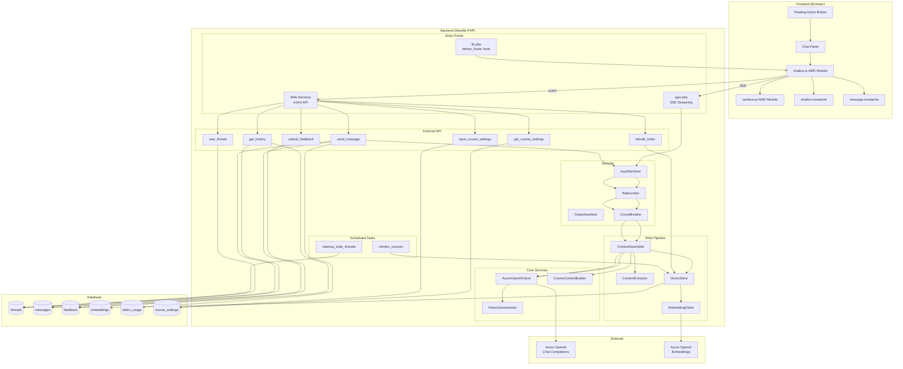
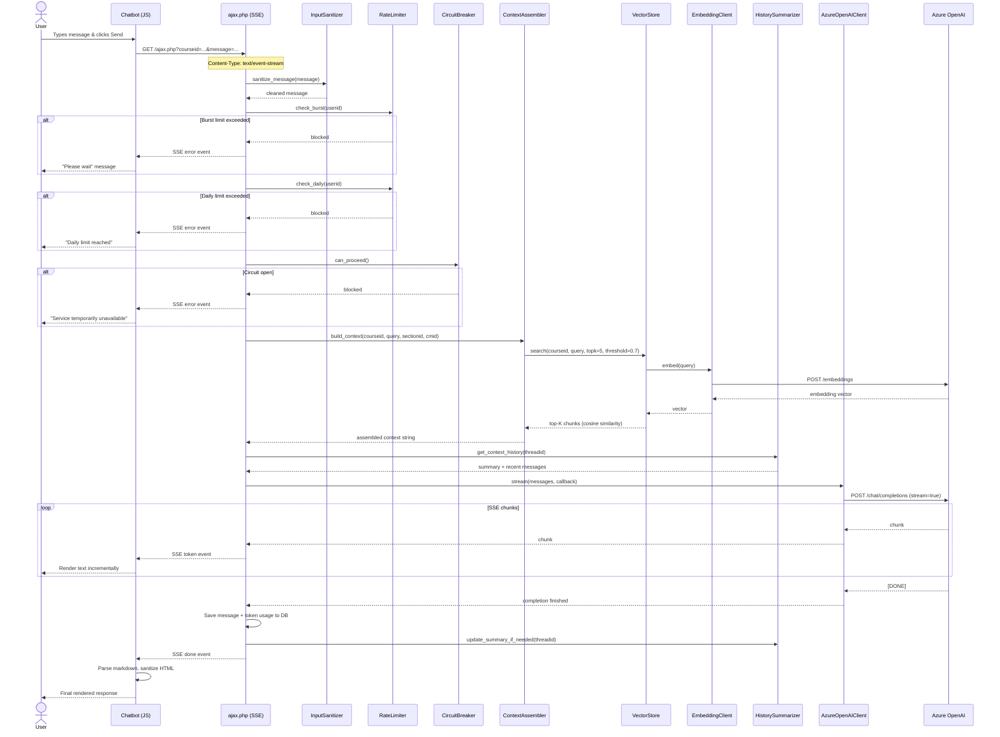
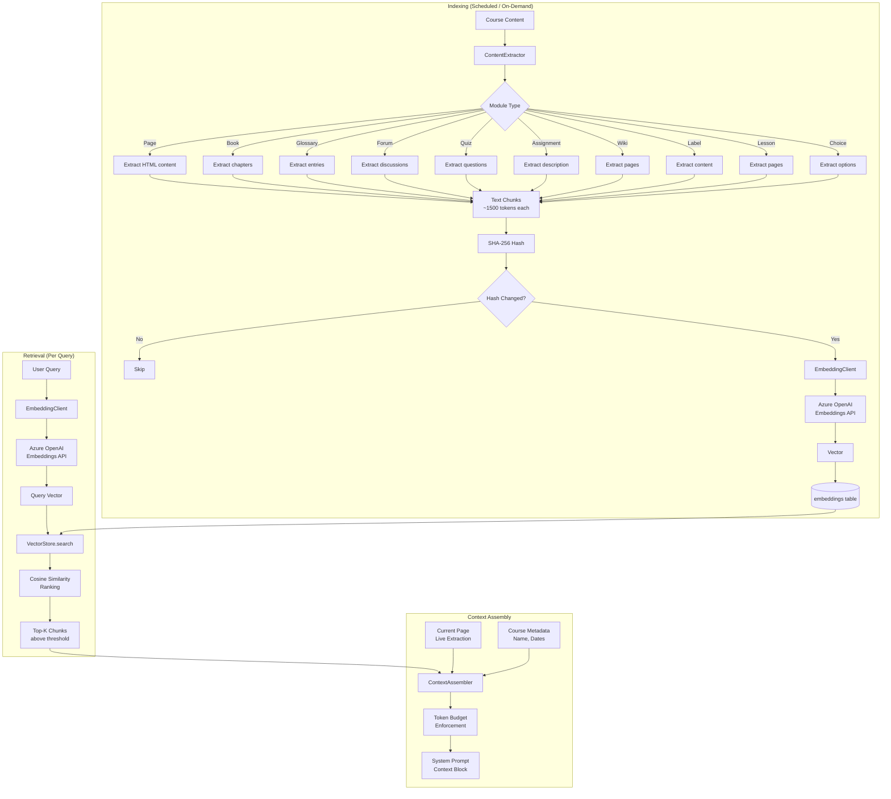
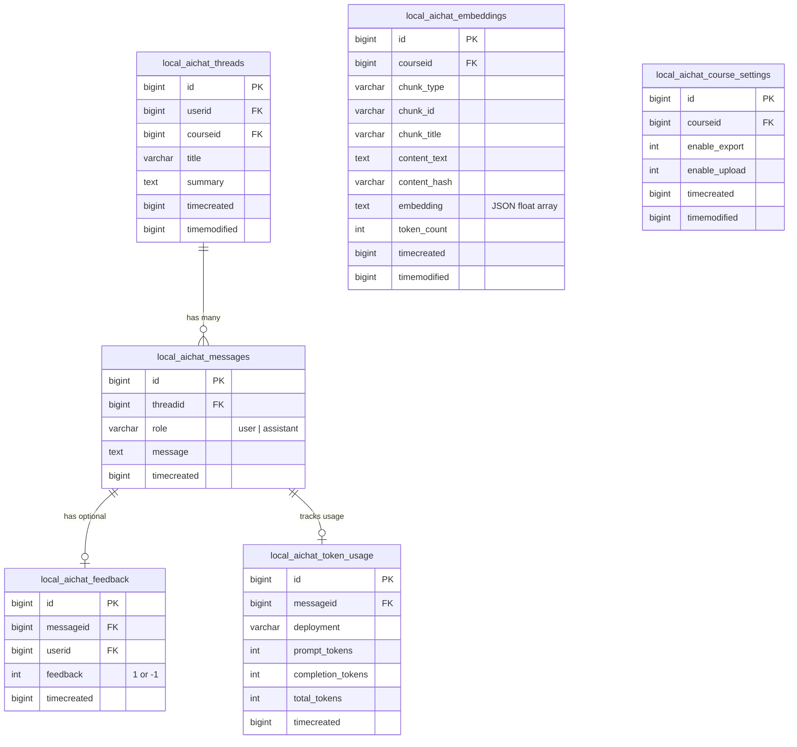
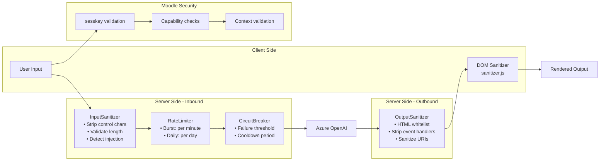
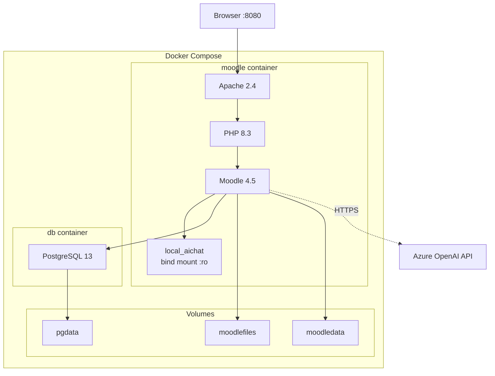
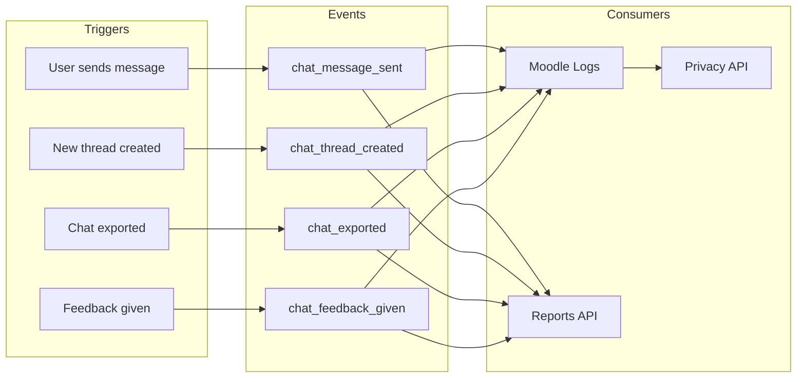

# Architecture

## Overview

The AI Chat plugin follows a layered architecture that integrates with Moodle's plugin API. It consists of a **frontend chatbot widget**, a **backend service layer** with RAG capabilities, and **Azure OpenAI** as the LLM provider.

```
┌─────────────────────────────────────────────────────────────────────┐
│                          Moodle Platform                            │
│                                                                     │
│  ┌──────────────┐    ┌──────────────────────────────────────────┐   │
│  │   Browser     │    │          local_aichat Plugin             │   │
│  │              │    │                                          │   │
│  │  ┌─────────┐ │    │  ┌────────┐  ┌──────────┐  ┌─────────┐ │   │
│  │  │Chatbot  │◄├────┤──┤  Web   │  │  RAG     │  │Security │ │   │
│  │  │AMD      │ │    │  │Services│  │ Pipeline │  │ Layer   │ │   │
│  │  │Module   │─┼────┼─►│        │  │          │  │         │ │   │
│  │  └─────────┘ │    │  └───┬────┘  └────┬─────┘  └────┬────┘ │   │
│  │  ┌─────────┐ │    │      │            │             │       │   │
│  │  │Sanitizer│ │    │  ┌───▼────────────▼─────────────▼───┐   │   │
│  │  │AMD      │ │    │  │        Azure OpenAI Client       │   │   │
│  │  └─────────┘ │    │  └──────────────┬───────────────────┘   │   │
│  └──────────────┘    └─────────────────┼───────────────────────┘   │
│                                        │                           │
│  ┌──────────────────────────────────┐  │                           │
│  │      Moodle Database (XMLDB)     │  │                           │
│  │  ┌────────┐ ┌────────┐ ┌──────┐ │  │                           │
│  │  │Threads │ │Messages│ │Embed.│ │  │                           │
│  │  │        │ │        │ │      │ │  │                           │
│  │  └────────┘ └────────┘ └──────┘ │  │                           │
│  └──────────────────────────────────┘  │                           │
└────────────────────────────────────────┼───────────────────────────┘
                                         │
                               ┌─────────▼──────────┐
                               │   Azure OpenAI     │
                               │  ┌───────────────┐ │
                               │  │  Chat API     │ │
                               │  │  (GPT-4o)     │ │
                               │  └───────────────┘ │
                               │  ┌───────────────┐ │
                               │  │ Embeddings API│ │
                               │  │(text-emb-3)   │ │
                               │  └───────────────┘ │
                               └────────────────────┘
```

---

## Component Diagram



---

## Message Flow

The following sequence diagram shows what happens when a user sends a message:



---

## RAG Pipeline Flow



---

## Database Schema (ERD)



---

## Security Architecture



---

## Deployment Architecture (Docker)



---

## Event System



---

## Cache Architecture

| Cache Store | TTL | Purpose |
|---|---|---|
| `burst_rate` | 120s | Tracks per-user message count within burst window |
| `circuit_breaker` | 600s | Stores circuit state (CLOSED/OPEN/HALF_OPEN) |

Both use the **application** cache store for cross-request persistence.

---

## Scheduled Tasks

| Task | Schedule | Purpose |
|---|---|---|
| `reindex_courses` | Daily at 02:00 | Re-embed course content older than 24h |
| `cleanup_stale_threads` | Daily at 03:00 | Delete threads with no user messages older than 30 days |
