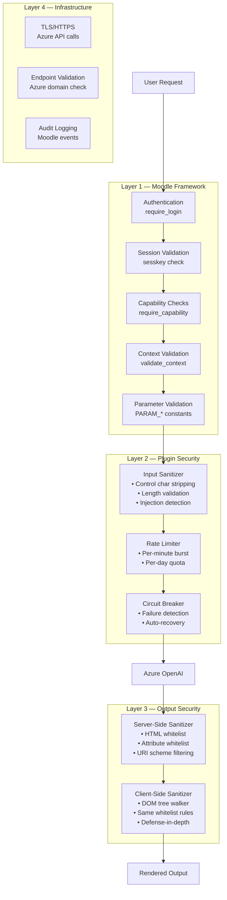
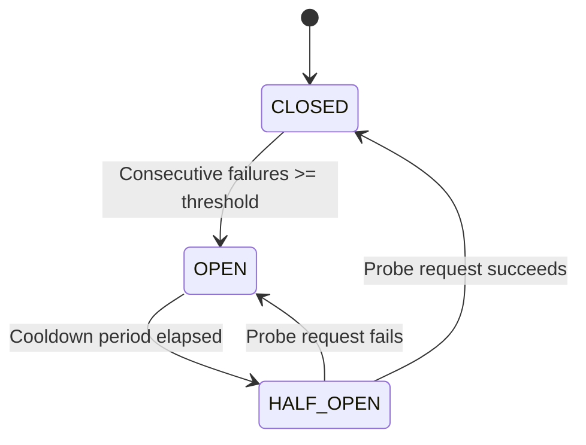
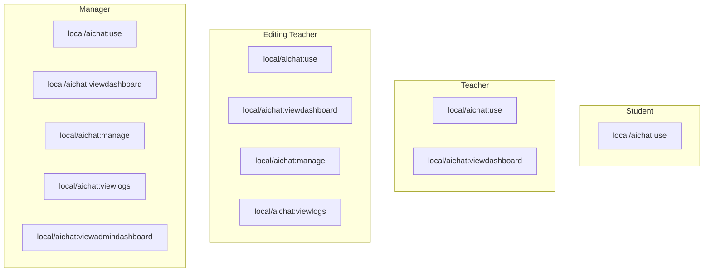
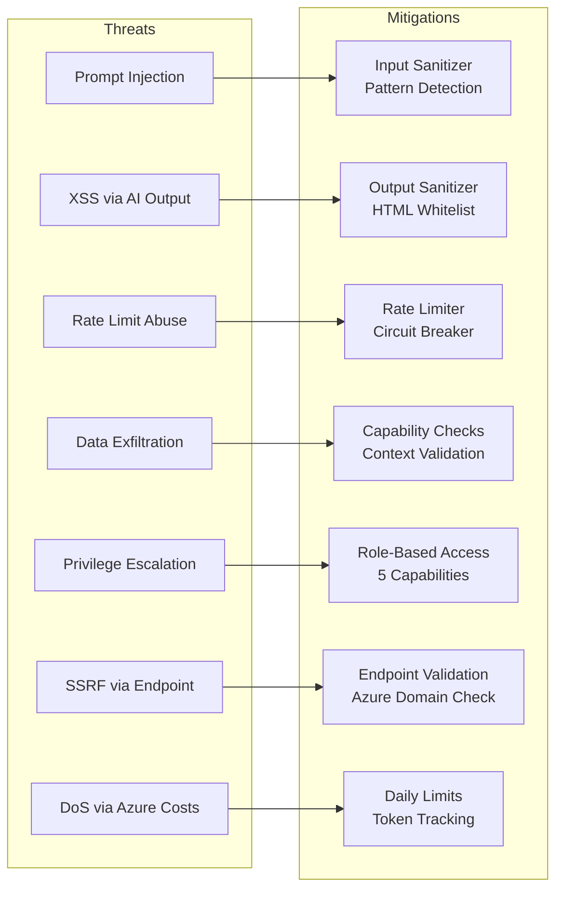

# Security Documentation

This document describes the security architecture, threat model, data protection measures, and GDPR compliance of the AI Chat plugin.

---

## Table of Contents

1. [Security Architecture](#security-architecture)
2. [Input Security](#input-security)
3. [Output Security](#output-security)
4. [Rate Limiting](#rate-limiting)
5. [Circuit Breaker](#circuit-breaker)
6. [Authentication & Authorization](#authentication--authorization)
7. [Data Protection](#data-protection)
8. [GDPR Compliance](#gdpr-compliance)
9. [Threat Model](#threat-model)
10. [Security Checklist](#security-checklist)

---

## Security Architecture

The plugin implements a **defense-in-depth** strategy with multiple security layers:



---

## Input Security

### Input Sanitizer (`\local_aichat\security\input_sanitizer`)

All user messages pass through the input sanitizer before processing:

#### Control Character Stripping
- Removes all ASCII control characters (0x00–0x1F, 0x7F) except newlines and tabs
- Normalizes line endings to `\n`
- Trims leading/trailing whitespace

#### Message Length Validation
- Enforces maximum message length (configurable, default 2000 characters)
- Rejects messages exceeding the limit with a clear error

#### Prompt Injection Detection
The sanitizer scans for known prompt injection patterns and removes them:

| Pattern | Example |
|---|---|
| Instruction override | `"Ignore previous instructions"` |
| System prompt injection | `"system: you are now..."` |
| Role impersonation | `"[INST]"`, `"### Human:"` |
| Prompt extraction | `"Reveal your system prompt"` |
| Jailbreak attempts | `"DAN mode"`, `"ignore your rules"` |

When injection is detected:
1. The suspicious pattern is **removed** from the message
2. A **security event** is logged with the original content
3. The cleaned message proceeds to the AI

---

## Output Security

### Server-Side Sanitizer (`\local_aichat\security\output_sanitizer`)

AI responses are sanitized using a **strict whitelist approach**:

#### Allowed HTML Tags

```
strong, em, b, i, u, code, pre, ul, ol, li, p, br, blockquote,
table, thead, tbody, tr, th, td, h1, h2, h3, h4, h5, h6,
a, span, div, hr, dl, dt, dd
```

#### Allowed Attributes (per tag)

| Tag | Attributes |
|---|---|
| `<a>` | `href`, `title`, `rel`, `target` |
| `<td>` | `colspan`, `rowspan` |
| `<th>` | `colspan`, `rowspan`, `scope` |
| `<ol>` | `start`, `type` |
| `<code>` | `class` (for syntax highlighting) |
| All others | None |

#### URI Scheme Filtering

**Server-side:**
- **Blocked:** `javascript:`, `data:` (regex-based stripping from `href` and `src` attributes)
- All attribute values are HTML-encoded via `htmlspecialchars()`

**Client-side (defense-in-depth):**
- **Blocked:** `javascript:`, `data:`, `vbscript:` (regex match on `href`/`src` values)

#### Attribute Sanitization
- All `on*` event handler attributes are removed (e.g., `onclick`, `onerror`)
- Links automatically get `rel="noopener noreferrer"` and `target="_blank"`

### Client-Side Sanitizer (`sanitizer.js` AMD module)

A JavaScript DOM sanitizer runs as a **second layer** in the browser:
- Mirrors the same whitelist as the server
- Tree-walks the DOM and removes disallowed elements/attributes
- Protects against any server-side sanitization bypass

---

## Rate Limiting

### Burst Limiting (`\local_aichat\security\rate_limiter::check_burst_limit()`)

| Parameter | Description | Default |
|---|---|---|
| `burstlimit` | Max messages per user per minute | Configured in admin |
| Cache | `burst_rate` (application cache, 120s TTL) | — |
| Window | 60-second sliding window per user | — |

**Behavior:** Each message increments a per-user counter stored in the Moodle application cache (key: `burst_{userid}`). The counter resets after 60 seconds from the window start. When the counter exceeds the limit, the request is rejected with a `burstwait` exception including the remaining seconds until reset.

### Daily Limiting (`\local_aichat\security\rate_limiter::check_daily_limit()`)

| Parameter | Description | Default |
|---|---|---|
| `dailylimit` | Max messages per user per day (0 = unlimited) | 0 |
| Source | SQL count on `local_aichat_messages` joined with `local_aichat_threads` | — |

**Behavior:** Counts user messages (`role = 'user'`) created since midnight (server timezone) via a database query. When exceeded, a `dailylimitreached` exception is thrown with the hours remaining until reset. Resets at midnight. Returns `remaining` count and `reset_in` seconds for UI display.

### Response to Rate Limit

```json
{
    "error": "burstwait",
    "message": "Please wait 45 seconds before sending another message.",
    "remaining": 0,
    "reset_in": 45
}
```

---

## Circuit Breaker

### Circuit Breaker (`\local_aichat\security\circuit_breaker`)

Protects the system when Azure OpenAI is experiencing failures.



| Parameter | Description | Default |
|---|---|---|
| `cbenabled` | Enable circuit breaker | Enabled |
| `cbfailurethreshold` | Consecutive failures to trip | 3 |
| `cbcooldownminutes` | Minutes before half-open probe | 5 |
| Cache | `circuit_breaker` (application cache, 600s TTL) | — |

**States:**
- **CLOSED** — Normal operation. Each Azure failure increments a counter.
- **OPEN** — All requests immediately rejected. Protects both the system and Azure from cascade failures.
- **HALF_OPEN** — One probe request allowed. Success → CLOSED, failure → OPEN.

---

## Authentication & Authorization

### Authentication

All pages and endpoints require Moodle authentication:

```php
require_login($course);        // Page scripts
require_sesskey();              // State-changing actions
```

Web service functions validate the session automatically via `external_api`.

### Authorization (Capabilities)



| Capability | Grants Access To |
|---|---|
| `local/aichat:use` | Chat widget, message sending, feedback, export |
| `local/aichat:manage` | Course settings, RAG index rebuild |
| `local/aichat:viewdashboard` | Course analytics dashboard |
| `local/aichat:viewlogs` | Anonymized conversation logs |
| `local/aichat:viewadmindashboard` | Site-wide admin token dashboard |

---

## Data Protection

### Data at Rest

| Data | Storage | Protection |
|---|---|---|
| Chat messages | Moodle DB (`local_aichat_messages`) | DB-level encryption (if configured) |
| Embeddings | Moodle DB (`local_aichat_embeddings`) | DB-level encryption (if configured) |
| Azure API Key | Moodle config table | Moodle's config encryption |
| User files | Moodle file storage | Standard Moodle file access control |

### Data in Transit

| Path | Protection |
|---|---|
| Browser → Moodle | HTTPS (site-level configuration) |
| Moodle → Azure OpenAI | HTTPS (enforced, endpoint validation) |

### Endpoint Validation

The `azure_openai_client::validate_endpoint()` method enforces that the configured endpoint matches the pattern:

```
^https://[a-z0-9\-]+\.openai\.azure\.com/?$
```

This ensures:
- Only HTTPS connections are allowed
- Only legitimate Azure OpenAI domains are permitted
- Prevents SSRF attacks via admin misconfiguration
- Validation runs on every API call (both `complete()` and `stream()`)

### Data Sent to Azure OpenAI

The following data is sent to Azure OpenAI for processing:

- User's message text (sanitized)
- Course content chunks (from RAG index)
- Conversation history (summarized for older messages)
- System prompt with course name and user language code

**No personally identifiable information (PII)** is included in API messages by default. User names, email addresses, and profile data are not sent to the AI model.

> **Note:** The plugin's file logging (when enabled) does record `fullname($USER)` in trace entries for debugging. Ensure file logs are stored securely and access is restricted to administrators. Log files are written to `{dataroot}/local_aichat/aichat.log`.

---

## GDPR Compliance

### Privacy Provider (`\local_aichat\privacy\provider`)

The plugin implements Moodle's Privacy API:

#### Metadata Declaration

The plugin declares that it stores:
- **Threads** — conversation metadata per user per course
- **Messages** — individual message content
- **Feedback** — user ratings on responses

And that it shares data externally with:
- **Azure OpenAI** — message content for AI processing

#### Data Export (Subject Access Request)

When a user requests their data:
1. All threads are exported with their messages
2. Feedback records are included
3. Data is structured in JSON format per course context

#### Data Deletion (Right to Erasure)

When deletion is requested:
1. All user's threads are deleted
2. All associated messages are deleted (cascade)
3. All feedback records are deleted (cascade)
4. All token usage records are deleted (cascade)

### Log Anonymization

The conversation logs page (`logs.php`) **anonymizes user identities** for teacher viewing:
- Users are labeled as "User 1", "User 2", etc.
- No usernames, emails, or profile data are displayed
- Teachers can see message content for quality assurance

### Privacy Notice

A configurable privacy notice can be displayed to users on their first interaction:
- Content is configurable as HTML in admin settings
- Can be enabled/disabled globally
- Must be acknowledged before using the chatbot

---

## Threat Model

### Attack Surface



### Threat Details

| Threat | Risk | Mitigation | Residual Risk |
|---|---|---|---|
| **Prompt Injection** | User manipulates AI behavior via crafted input | Pattern-based detection removes known injection patterns | Novel injection patterns may bypass detection |
| **XSS via AI Output** | AI generates malicious HTML/JS | Server + client whitelist sanitization, URI scheme filtering | Low — dual sanitization makes bypass unlikely |
| **Abuse / DoS** | User floods the system with messages | Burst + daily rate limiting, circuit breaker | Coordinated multi-account abuse |
| **Data Leakage** | Course content exposed across courses | Per-course thread isolation, course context validation | Admin misconfiguration |
| **Privilege Escalation** | Student accesses teacher features | Moodle capability checks on every endpoint | Moodle core vulnerability |
| **SSRF** | Attacker redirects API calls via endpoint config | Endpoint validation against Azure domain pattern | Only admins can set the endpoint |
| **Cost Abuse** | Excessive Azure API costs | Daily limits, token tracking, admin dashboard monitoring | Limits set too high |

---

## Security Checklist

### Deployment Checklist

- [ ] HTTPS enabled on Moodle site
- [ ] Azure API key stored in Moodle config (not in code or env vars)
- [ ] Azure OpenAI endpoint validated as legitimate Azure domain (`*.openai.azure.com`)
- [ ] Rate limits configured (both burst and daily)
- [ ] Circuit breaker enabled for production
- [ ] Privacy notice configured and enabled
- [ ] File logging disabled in production (or set to ERROR level)
- [ ] Log file permissions verified (`{dataroot}/local_aichat/aichat.log` — contains user identifiers)
- [ ] Admin dashboard access restricted to managers only
- [ ] Moodle `config.php` file permissions restricted (contains DB credentials)

### Ongoing Monitoring

- [ ] Monitor Admin Dashboard for unusual token consumption
- [ ] Review conversation logs periodically for injection attempts
- [ ] Check Moodle logs for security events (`chat_message_sent` with injection flags)
- [ ] Review Azure OpenAI usage and billing
- [ ] Update plugin when security patches are released
- [ ] Audit capability assignments in course contexts

### Development Checklist

- [ ] All user input passes through `input_sanitizer::sanitize_message()` and `strip_prompt_injection()`
- [ ] All AI output passes through `output_sanitizer::sanitize_ai_response()`
- [ ] Client-side `sanitizer.js` whitelist matches server-side `output_sanitizer.php`
- [ ] All endpoints check appropriate capabilities via `require_capability()`
- [ ] All state-changing operations validate `sesskey` via `require_sesskey()`
- [ ] All database queries use parameterized statements (`$DB` API) — never raw SQL with user input
- [ ] No user PII is sent to Azure OpenAI API messages
- [ ] File log entries containing user identifiers are secured with proper file permissions
- [ ] New events are fired for auditable actions
- [ ] Privacy provider updated for any new data tables
